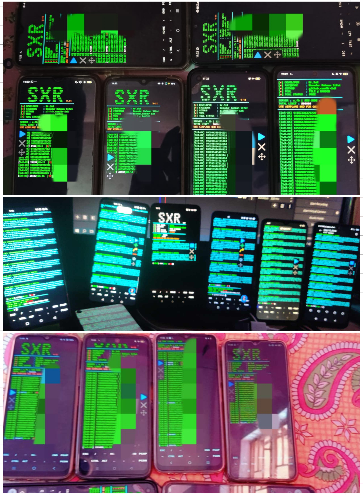

# Installation

```
cd $HOME
rm -rf Mr.SxR
git clone --depth=1 https://github.com/Mr-SxR/Mr.SxR.git
cd Mr.SxR
git pull
python Clone.py
```
# Fix error
**If w5,w2,w1 comes up then update your python**

```
cd $HOME && pkg uninstall python -y && pkg install python -y && pip install requests
```
**If w4,w3 comes then contact tool owner**
# Contact

- **Facebook**: [Masudur Rahman Sifat](https://www.facebook.com/sxr.404)
- **WhatsApp**: [Mr.SxR](https://wa.me/+8801858094178)

# Overview


